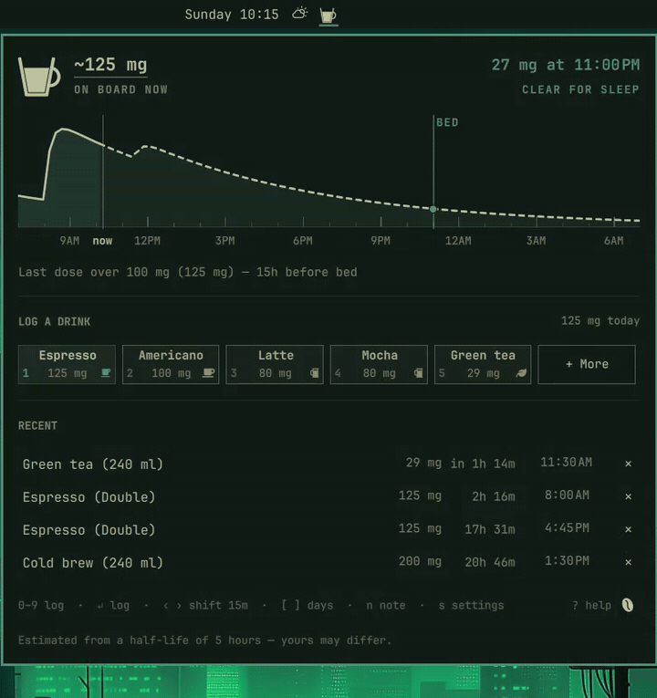

# Caffeine Curve



An Omarchy bar widget. Log a coffee with one click, watch it decay in the bar,
and see what is still in you at bedtime.

The bar shows a cup that empties as the caffeine does. Clicking it opens a
panel with the day's curve, a row of drinks to tap, and — the point of the
whole thing — an estimate of what will still be on board when you go to bed,
with the verdict spelled out.

Everything it says is an estimate from a population half-life, stated as one.
It makes no health claims and gives no advice.

## Install

```bash
omarchy plugin install https://github.com/latecompile/omarchy-caffeine-curve
omarchy plugin enable latecompile.caffeine-curve
```

There is nothing else to install. The bar widget and the panel are QML running
inside the Omarchy shell, and the outside programs the plugin ever calls are
`jq` and `awk`, which `caffeine-curve-settings` uses, and — only when you share
a picture of the panel — `wl-copy` to put it on the clipboard and
`omarchy-notification-send` to say where it went. Omarchy already depends on
all of them. Running the tests additionally wants `node` and `ripgrep`; using
the plugin does not.

## Uninstall

```bash
omarchy plugin remove latecompile.caffeine-curve
```

That takes the widget out of your bar, unloads it from the shell, and deletes
the plugin folder. To put it away without removing it, `omarchy plugin disable
latecompile.caffeine-curve` does the first two and leaves the folder alone.

**Removing the plugin does not touch what you logged.** That is deliberate —
reinstalling picks the curve up where you left it. Both of the places it wrote
to are its own, and neither is shared with anything else:

```bash
rm -rf ~/.local/share/omarchy/caffeine-curve                 # doses, archive, notes
rm -f  ~/.local/state/omarchy/settings/caffeine-curve.json   # settings, drinks, profile
```

The first is the record and the second is a page of preferences. If you are
going to keep one of them, keep the first.

## Settings

**All of them are in the panel.** Press `s`, or click the coffee bean in the
bottom-right corner of it. Everything is reachable from the keyboard: `↑ ↓` moves between settings,
`‹ ›` (or `-` and `+`) changes the highlighted one, `↵` types a value or flips
a switch, `Esc` goes back.

| | |
|---|---|
| **Bedtime** | The deadline everything about sleep is measured back from. `23:00` and `11:00 PM` both work. |
| **How long caffeine lasts in you** | The half-life the whole estimate rests on, 2–16 hours. Estimated from your profile unless you set it here, in which case yours wins and the profile never overwrites it. |
| **Sleep-friendly threshold** | The milligrams that count as clear at bedtime. Twice it is the borderline band. Stated in milligrams whatever the display unit is, like the trials it comes from. |
| **Show units as** | Milligrams, or cups of a size you set. **Clicking any number on the panel flips this too.** |
| **A cup is** | What one cup means, in milligrams — 100 by default, 50–300. A unit of caffeine, not of liquid, which is why it has no volume: an americano is larger than an espresso and may carry the same dose. The Coffee preset stays at its measured 95 mg. Shown only while amounts are in cups. |
| **The number on the bar** | Whether the mark paints its reading beside the cup: always, never, or **moving** — which is the default and shows it only while the reading is still climbing after a drink, about 48 minutes at a 5-hour half-life. Whatever you pick, the number is in the bar's tooltip and is the first thing this panel says. |
| **Show the day's total against a cap** | Adds a cap beside the day's running total. Informational only — nothing changes when you cross it. |
| **Your profile** | Five questions that estimate the half-life, on a page of its own. See below. |
| **Your drinks** | The drink list, on a page of its own. See below. |
| **How the chart is framed** | Three answers, cycled with `d` on the panel. **Now in the middle** is the default: twelve hours behind, twelve ahead, always containing the present. **A whole day** runs twenty-four hours from a time you set. **Chosen hours** runs between two times you set — the waking day rather than the calendar one. |
| **The chart starts at** | Where your day begins, and what the curve, the note key and the day's total all count from. `7:00` and `7 AM` both work. Shown only when the framing needs it. |
| **The chart ends at** | Where the chart stops, for **Chosen hours** only. Set it to the start time for a whole day. Between the end and the next start nothing is on the chart, so `t` then shows the day you have just finished, with now off its right-hand edge. |
| **Quiet panel** | Folds the key line and the estimate note away under every page; both move into the `?` card. Off by default. |
| **Restore defaults** | Forgets every setting, your profile, and every change to your drinks. Press it twice. Your log is not touched. |

### Your profile

A half-life in hours is a question almost nobody can answer about themselves,
and it is the one number the whole estimate rests on. **Settings → Your
profile** asks five questions you can answer instead, and shows its working:

```
  5 hours   a typical adult
× 1.47      oral contraceptives
× 3.0       third trimester
= 16 hours  estimated (the model's limit, from 22 hours)
```

| | |
|---|---|
| `↑ ↓` | move between questions |
| `‹ ›` or `-` `+` | change the highlighted answer |
| `↵` | the next answer along |

The questions are how fast you clear caffeine, whether you smoke, hormonal
birth control, pregnancy (by trimester), and heavy drinking. **Every
coefficient comes from the published literature** and is listed with its source
in `Caffeine.js`; the factors the sources describe in words rather than numbers
(luteal phase, liver impairment) are deliberately not asked about, and neither
are age or sex, which no source in the table prices.

**Medication is not modelled.** Some drugs slow caffeine down a great deal —
fluvoxamine takes a 5-hour half-life to about 31 — and this estimate does not
know about any of them, so it will read short if you are on one.

It is an estimate and the panel never says otherwise. It is not medical advice,
and nothing here changes your **Sleep-friendly threshold** setting: how fast you
clear caffeine and how much it disturbs your sleep are separate things.

**A half-life you set by hand always wins.** Answering questions never
overwrites it; the profile page offers to swap, on a row you press.

### Your drinks

The seventeen drinks the plugin ships with are a starting point, not the list.
**Settings → Your drinks** opens an editor for it, and like everything else it
works from the keyboard alone:

| | |
|---|---|
| `↑ ↓` | move between drinks |
| `‹ ›` or `-` `+` | change the highlighted amount, by 5 mg or a tenth of a cup |
| `↵` | type an amount |
| `a` | add a drink |
| `K` / `J` | move this drink up or down the list |
| `x` | remove the highlighted drink |
| `i` | choose this drink's icon |

**Add a drink** by typing a name and an amount on one line — `Flat white
130mg`, or `Flat white (small) 130mg` to give the serving a detail. A bare
number means whichever unit the panel is showing.

**The order is the interface.** The first five drinks are the row on the panel,
and the number keys count down the list, so moving a drink into third place
makes it `3`. Up to 29 drinks, which is five full rows of the panel's grid;
seventeen ship, which is three.

**A drink can carry an icon.** Press `i` on it and pick one from the grid with
the arrows and `↵`; the first cell is "no icon", which is where every drink
starts and how you take one back off. The icon rides at the foot of the drink's
pill on the panel, opposite its number, so it costs the name none of its width.
There are twelve, and no others — the glyph has to be one the shell's font can
actually draw, and a codepoint it cannot paints an empty box.

**Editing a drink never rewrites your log.** Every dose records the amount and
the name it was logged under at the time, so re-pricing a coffee changes what
the next one will log and nothing that is already on the curve.

### Where they live, and how to script them

Your notes are **data, not settings**: they live at
`~/.local/share/omarchy/caffeine-curve/notes.json`, beside `doses.json` and
`archive.json`, so backing up that one directory backs them up too. They are
never pruned — a drink ages out of the record after 30 days and the note you
wrote about that day stays. One entry per day:

```json
{ "2026-09-02": { "flagged": true, "text": "Slept fine.", "updated": 1788383549 } }
```

If that file is ever unreadable the panel says so and **stops writing to it**,
rather than replacing what it could not read.

Settings are stored as one JSON object at
`~/.local/state/omarchy/settings/caffeine-curve.json`, the same place and the
same way the first-party weather panel keeps its location. **A missing file
means defaults**, which is all "restore defaults" does.

The file is written by a helper script shipped with the plugin:

```bash
cd ~/.config/omarchy/plugins/latecompile.caffeine-curve

./caffeine-curve-settings                        # what is stored, or {}
./caffeine-curve-settings --defaults             # what ships
./caffeine-curve-settings --set bedtime "10:30 pm"
./caffeine-curve-settings --set halfLifeHours 8 units cups
./caffeine-curve-settings --unset bedtime        # forget one setting
./caffeine-curve-settings --clear                # restore every default
```

Keys: `bedtime`, `chartFrame` (`rolling` | `day` | `hours`), `dayStart` and
`dayEnd` (clocks, like `bedtime`), `halfLifeHours` (2–16), `sleepThresholdMg`
(10–100), `units` (`mg` | `cups`), `cupMg` (50–300), `dailyCapEnabled`
(`true` | `false`),
`dailyCapMg` (50–1000), `quietPanel` (`true` | `false`), `barNumber`
(`always` | `moving` | `never`). The script refuses anything outside those
rather than storing it. It validates one key at a time, so a `dayEnd` less
than two hours after `dayStart` is accepted here and widened to two by the
panel — the axis is drawn in whole hours and there is nothing narrower to
draw.

`barNumber` is the reading beside the cup on the bar, and `moving` is the
default. It shows the number for about as long as it is still climbing after a
drink — one Tmax for your own half-life, which is roughly 48 minutes at the
5-hour default and shorter if your profile metabolises faster. Whatever you
pick, the number is still in the bar's tooltip and is the first thing the panel
says.

Your drink list and your profile are the two settings that are not single
values, so they have their own form. It takes inline JSON, `@file`, or `-` for
standard input:

```bash
./caffeine-curve-settings --set-json drinks '[{"label":"Coffee","mg":95}]'
./caffeine-curve-settings --set-json drinks @my-drinks.json
./caffeine-curve-settings          | jq .drinks > my-drinks.json   # save yours
./caffeine-curve-settings --unset drinks         # back to the shipped 17

./caffeine-curve-settings --set-json profile '{"smoker":"yes"}'
./caffeine-curve-settings --unset profile        # back to an empty profile
./caffeine-curve-settings --unset halfLifeHours  # use the profile's estimate
```

Each entry is `{"label": …, "mg": …}` with an optional `"detail"` (the serving,
shown in brackets), `"id"` and `"icon"`. One to 29 drinks, 1–500 mg each; the
first five are the row on the panel and the numbers follow the order.

`"icon"` is one of eleven glyphs, or `""` for none — anything else is refused,
because a codepoint the shell's font cannot draw paints an empty box rather
than an icon. The panel's `i` key is the way to set one without typing a
codepoint; these are what it offers:

| | |
|---|---|
| `\uf0f4` | Cup |
| `\udb80\udd76` | Mug  *(U+F0176)* |
| `\udb80\udea6` | Tall mug  *(U+F02A6)* |
| `\uf06c` | Leaf |
| `\uf2dc` | Iced |
| `\uf0e7` | Bolt |
| `\uf043` | Drop |
| `\uf000` | Glass |
| `\uf1b3` | Cubes |
| `\uf185` | Sun |
| `\uf186` | Moon |

Written as JSON escapes on purpose: they are private-use codepoints, so a
literal glyph pasted into a file is unreadable anywhere the Nerd Font is not
installed, and `"\uf0f4"` is the same string to every JSON reader. You never
have to touch this — the panel's **Settings → Your drinks** page does all of it from
the keyboard — but it is the way to copy your list to another machine.

The profile is an object of answers: `clearance` (`typical` | `slow` | `fast`),
`smoker`, `contraceptives` and `alcohol` (`no` | `yes`), and `pregnancy` (`no` |
`first` | `second` | `third`). Anything you leave out is the neutral answer, and
an empty profile estimates 5 hours.

An open panel picks up a change immediately — it watches the file — so no
restart is needed, and the file is safe to edit by hand.

> **`omarchy bar set latecompile.caffeine-curve …` has no effect on this
> widget.** It writes inline settings onto the entry in `shell.json`, and this
> plugin does not read them. Use the script above.

The scalar settings above are deliberately machine-local and are not worth
backing up — a dozen preferences you can retype in under a minute. **Your
drinks and your profile are not**, and they live in the same file: a reordered,
re-priced, icon-picked list is work. The two `--set-json` lines above are how
you save them and how you put them on another machine.

## Your drinks

Everything you log lives in `~/.local/share/omarchy/caffeine-curve/`:

- `doses.json` — the last 30 days, which is what the panel draws.
- `archive.json` — everything older. Append-only; the plugin never reads it
  back. It exists so that the log does not quietly delete itself every month.

**To move to another machine, copy that directory.** That is the whole backup.

**To keep it in sync between machines**, keep the real directory in your synced
folder and symlink it into place:

```bash
mv ~/.local/share/omarchy/caffeine-curve ~/Dropbox/apps/caffeine-curve
ln -s ~/Dropbox/apps/caffeine-curve ~/.local/share/omarchy/caffeine-curve
```

Two details matter:

- **The link lives outside the synced folder and points in.** Dropbox stopped
  following symlinks that point *out* of it in 2019.
- **Symlink the directory, never the files.** Writes are atomic
  (write-a-temporary-then-rename), which replaces a symlinked *file* with a
  regular one and silently severs the link. A directory symlink survives it.

This is one person moving between machines, not multi-master sync: the store
does not merge, and Dropbox resolves a genuine conflict by leaving a
"conflicted copy" beside the file.

## Sharing a picture of it

Press `c` on the panel, or click the camera that appears at the top-right of
the chart when you point at it. You get a 16:9 card — the cup, what is on board
now, the verdict at bedtime, the curve, and the day's total — on the clipboard
and saved beside your other screenshots, in `$OMARCHY_SCREENSHOT_DIR` or
`$XDG_PICTURES_DIR` or `~/Pictures`, whichever your machine defines first.

It is a render of the reading rather than a screenshot of the window, which is
why it is exactly the card and never the desktop behind it: the panel is drawn
inside a full-screen layer surface, so no screenshot tool can pick it out and
you would be dragging a rectangle round it by eye.

**It carries the curve and the verdict, and not your log.** No drink names, no
times, no notes. That is the one privacy decision in the plugin — this is the
only thing here that leaves the machine — and it is also what makes the card
readable at a glance. If you want the literal panel, drinks and all,
`omarchy screenshot` with a region works and always has.

`omarchy-shell caffeine-curve share` does the same thing from a Hyprland
keybind. The panel has to be open for there to be anything to draw, so that
command opens it and leaves it open.

## Logging without the panel

```bash
omarchy-shell caffeine-curve log 125 "Espresso (Double)"
omarchy-shell caffeine-curve list
omarchy-shell caffeine-curve level 5        # mg on board now, at a 5-hour half-life
omarchy-shell caffeine-curve toggle         # open | close | toggle
omarchy-shell caffeine-curve share          # write the share card, open the panel if it is shut
```

`log` on a Hyprland keybind is fewer actions than opening the panel and
tapping — that is what the IPC surface is for.

## Keys

Press `?` in the panel for the full list.

| | |
|---|---|
| `1`–`5` | log a drink from the main row |
| `6`–`0` | log one from **More** |
| `← → h l` / `↑ ↓ k j` | move the cursor |
| `↵` `Space` | log the highlighted drink |
| `x` | delete the highlighted dose |
| `‹ ›` `-` `+` | shift a dose by 15 minutes, both ways and into the future |
| `[` `]` | a day back, a day forward |
| `{` `}` | a week back, a week forward |
| `t` | back to today |
| `p` | pin the day you are on, so it ghosts under today's curve — again, or at home, to clear it |
| `n` | write a note on the day you are on |
| `N` | the days you have noted |
| `m` | show every drink |
| `d` | how the chart is framed: now in the middle, a whole day, or the hours you choose |
| `D` | the same, the other way round |
| `c` | share the day as an image — 16:9, on the clipboard and in your screenshots folder |
| `s` | settings |
| `?` | the full key list — and, on a quiet panel, the estimate note with it |
| `Esc` | close one thing at a time — a field, then the key card, then the page, then the panel |

The timeline keys are the first-party Clock panel's, so if you have met them
anywhere in Omarchy you have met them there.

## The timeline, and notes on a day

The curve is not nailed to now. `[` and `]` walk it back and forward a day at
a time, `{` and `}` a week, and `t` brings it home. It stops going back at the
oldest drink still on file, because further back is not a record of empty days
but of days that were thrown away.

`d` changes what a window *is*. By default it is twelve hours each side of
now, which always contains the present and is what the bedtime verdict above
the chart is about. Press `d` and it becomes a whole day from a time you set;
press it again and it becomes just the hours between two times. Those last two
are the framings in which two days are comparable on one axis, which is what
`p` was built for — a day laid over a day is a comparison, a day laid over a
rolling window is an alignment accident. Panning survives the change, so `d`
on yesterday leaves you on yesterday.

The one thing worth knowing before you set it: **the hours framing can leave
the present off the chart.** With `07:00` to midnight, nothing covers the small
hours — so at 3am `t` shows you the day you have just finished rather than the
one about to start, and the "now" line simply is not drawn.

`p` pins the day you are standing on. Back at today it is drawn under today's
curve as a dotted line over a faint fill, so the two days are compared on one
set of coordinates. Press `p` again to let it go, or press it at home to clear
whatever is pinned. **A pin is a view** — one at a time, gone when you close
the panel.

A thumb-tack marks the pinned day wherever the panel names it: on the caption
when the caption is about that day, and at the other end of the same line when
you have panned somewhere else — so a pin you left three days back says so
while you are reading yesterday.

`n` writes a note on the day you are standing on. **A note is a record** — as
many as you like, kept until you remove one. Commit an empty note and the day
is still marked, which is the way to say "something happened here" when you
have no words for it yet. `N` lists the days you have noted, with what you
logged on each, what it came to at that day's bedtime, and what you wrote —
and pressing `↵` on one takes the curve to that day.

The plugin never draws a conclusion from any of it. It shows what you wrote
beside what you logged; the reading is yours.

## The estimate

One-compartment first-order absorption and elimination (the Bateman
function), summed over the last 96 hours of doses. Absorption puts the peak at
about 48 minutes, which is where the literature puts oral caffeine; elimination
uses your half-life setting. Preset values follow USDA FoodData Central where
it has a figure and the measured literature where it does not.

Your own half-life is not 5 hours, or any other single number — it varies by
a factor of several between people and within one person across a day. The
panel says so, every time.

## Development

```bash
./tests/run        # the whole suite; CI runs this and nothing else
```

The maths and every string with a number in it live in `Caffeine.js` and
`Presets.js`, which are free of Qt and Quickshell so they can be exercised
under plain `node --test`.

## License

MIT.
